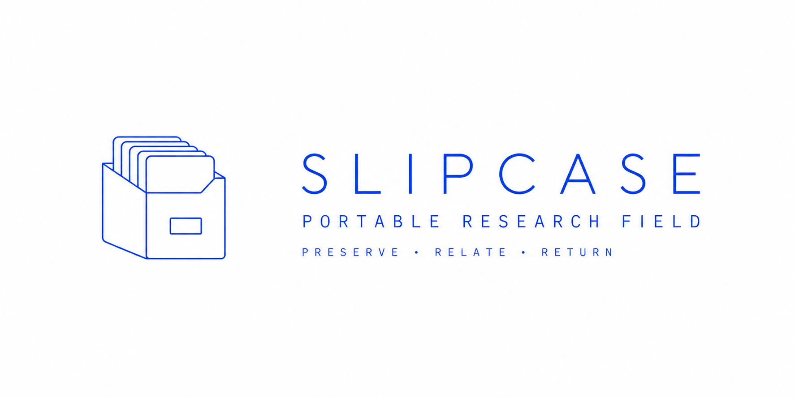

# SLIPCASE — Portable Research Field & Prompt Operator

<p align="center">
  
</p>

<p align="center">
  <strong>Preserve &middot; Relate &middot; Return</strong><br>
  <em>A self-contained, mobile-first research console, zettel lines inspector, slipcard flipper, PDF reader, and prompt operator across 31 field slipcases.</em>
</p>

---

## Overview

**SLIPCASE** is an offline-capable, zero-dependency research desk and portable capsule designed for mobile devices and desktop environments. It unifies five core research faculties into a single fast, responsive interface (`index.html`):

1. **[LINES] Zettel Lines Inspector**: Complete atomic breakdown of all **1,244 zettel cards** into structured, selectable field rows (`QUESTION`, `DEEPER QUESTION`, `PASSAGE`, `RESEARCH OBJECT`, `LOCAL MOVE`, `MECHANISM`, `FORMAL SHIFT`, `BIBTEX`, etc.) with multi-line selection, continuous reading stack, and clipboard export.
2. **[FLIPPER] Tactile Card Deck**: Touch-swipe enabled card deck flipper with formatted/raw source toggles, core question callouts, and one-tap payload export.
3. **[PDFS] Research PDF Library & Dual Reader**: Curated library of **124 primary research PDFs** (compiled papers and source scans) with instant search, category filtering, embedded preview, and direct fullscreen tab breakouts (`&nearr;`).
4. **[MAPS] Case Inspector & Structural Field Maps**: Instant inspection of derived structural documents (`000__START_HERE.txt`, `000__MAP.txt`, `000__BIBLIOGRAPHY.txt` / `.bib`, `000__LINEAGE.txt`, `000__OPEN_EDGES.txt`, `000__MAKING_HISTORY.txt`).
5. **[PROMPTS] Prompt Operator Console**: The complete **Cool Radio** suite of 8 structured POML research instruments (`FORAGE 3.0`, `FORAGE 3.1`, `FORAGE 4.0`, `SLIPCASE 9.0`, `SLIPCASE 13.1`, `SLIPCASE 15.0`, `SLIPCASE 15.55-AM`, and `OPERATIONAL PRAGMATIST`) with one-tap copy-and-advance and `.poml` downloads.

---

## Architecture & Layout

```
+------------------------------------------------------------------------+
|                        SLIPCASE RESEARCH DESK                          |
+-----------------+------------------+-----------------+-----------------+
| [LINES]         | [FLIPPER]        | [PDFS]          | [MAPS] & PROMPT |
| Structured Rows | Tactile Card     | 124 Curated     | Structural Maps |
| Multi-Select    | Raw / Parsed     | Dual-Engine     | 8 POML Tools    |
| Stack Reader    | Touch Swipe      | Direct Open     | 31 Workspaces   |
+-----------------+------------------+-----------------+-----------------+
```

### 1. Zettel Lines Inspector
- **Field-by-Field Breakdown**: Inspect cards by atomic epistemological fields.
- **Filter Chips**: Filter by `ALL`, `QUESTIONS`, `PASSAGES`, `OBJECTS`, `MECHANISMS`, `FORMALISMS`, `TYPES`, `SOURCES`, or use the extended modal sheet for any field.
- **Multi-Line Selection**: Tap any row to select. Long-press, right-click, or tap the zettel header to select the entire card.
- **Reading Stack Sheet**: Slide-up continuous reading flow for all selected lines with one-tap clipboard copy (`&orarr;`).

### 2. Tactile Card Deck Flipper
- **Workspace Navigation**: Switch between all 31 slipcases or browse global decks.
- **Mobile Touch Swipe**: Swipe left/right on touchscreens to flip cards naturally.
- **Raw / Parsed Mode**: Toggle between typography and exact monospace `.txt` source.
- **Direct Export**: One-tap card copy or download as standalone `.txt` file.

### 3. Mobile PDF Library & Reader
- **124 Research PDFs**: Access compiled working papers, preprints, and archival scans.
- **Category Filter**: Filter between *Compiled Papers* and *Source / Archival Scans*.
- **Dual-Engine Reading**: Embedded preview modal plus direct `OPEN PDF &nearr;` links guaranteed to work in all desktop and mobile sandboxes.

### 4. Case Inspector & Structural Maps
- Inspect derived structural documents for each slipcase:
  - `000__START_HERE.txt` (Overview & checkpoint state)
  - `000__MAP.txt` (Complete textual relationship graph)
  - `000__BIBLIOGRAPHY.txt` / `.bib` (Compiled citations and citekeys)
  - `000__LINEAGE.txt` (Inquiry descent paths)
  - `000__OPEN_EDGES.txt` (Unresolved frontier questions)
  - `000__MAKING_HISTORY.txt` / `000__RETURN_PATH.txt`

### 5. Prompt Operator (Cool Radio Suite)
- **8 POML Research Instruments**:
  - `01 FORAGE 3.0` (Inquiry + Opposition &mdash; atomic zettel generation)
  - `02 FORAGE 3.1` (Recursive Inquiry &mdash; live-edge following)
  - `03 FORAGE 4.0` (Autonomous Graph Inquiry &mdash; expected epistemic gain steering)
  - `04 SLIPCASE 9.0` (The Compact Compiler &mdash; flat deck, graph, bib, reader, paper)
  - `05 SLIPCASE 13.1` (Lineage-Aware Compiler &mdash; descent laws & provenance)
  - `06 SLIPCASE 15.0` (The Ancient Master &mdash; 12 field operations)
  - `07 SLIPCASE 15.55-AM` (Portable Research Field &mdash; take-a-real-stab checkpointing)
  - `08 OPERATIONAL PRAGMATIST` (Wittgenstein Editor &mdash; control-surface overhaul)
- **One-Tap Copy & Advance**: Tap once to copy the prompt to clipboard and auto-advance to the next instrument.
- **Keyboard Shortcuts**: `ArrowLeft` / `ArrowRight` to step through instruments.

---

## 31 Included Slipcases

| # | Workspace / Case | Slips | PDFs | Field Docs |
|---|---|---|---|---|
| 01 | `prompt-semantics-hidden-machinery` | 19 | 1 | 10 |
| 02 | `mycelium-sole-field` | 15 | 3 | 11 |
| 03 | `the-shop-makes-the-prompt` | 45 | 11 | 11 |
| 04 | `martina-deferred-specification` | 47 | 2 | 13 |
| 05 | `prompt-battles-smackdown` | 28 | 4 | 11 |
| 06 | `what-can-you-still-reopen` | 21 | 4 | 11 |
| 07 | `what-kind-of-thing-is-the-model` | 69 | 1 | 10 |
| 08 | `Mastery_Without_Sovereignty` | 38 | 4 | 12 |
| 09 | `HOUSE_LANGUAGE_SUBURB` | 47 | 2 | 10 |
| 10 | `the-unlived-curriculum` | 23 | 6 | 11 |
| 11 | `SLIPCASE_AFTER_SURPRISE_FINAL` | 156 | 4 | 10 |
| 12 | `SLIPCASE_DEEP_LINEAGE` | 120 | 13 | 10 |
| 13 | `PROMOTION_FIELD` | 29 | 1 | 10 |
| 14 | `theory-lag` | 31 | 2 | 14 |
| 15 | `THE_HUT__FINAL_FIELD` | 1 | 1 | 1 |
| 16 | `YELMO_FINAL` | 24 | 3 | 10 |
| 17 | `black-mountain-structured-openness` | 27 | 3 | 10 |
| 18 | `house-language__FULL-FINAL` | 38 | 4 | 12 |
| 19 | `house_language_many_mansions` | 61 | 1 | 10 |
| 20 | `how_is_this_gonna_be_screwed_up` | 5 | 1 | 0 |
| 21 | `primitive_construction_slipcase` | 15 | 1 | 10 |
| 22 | `prompt-forward-slipcase` | 94 | 1 | 10 |
| 23 | `prompt-magic-generative-trajectory` | 26 | 1 | 10 |
| 24 | `prompt-practices__FINAL` | 31 | 3 | 12 |
| 25 | `safe-relational-freedom-field` | 49 | 8 | 11 |
| 26 | `slipcase-intro` | 24 | 1 | 10 |
| 27 | `slipcase_final` | 45 | 8 | 11 |
| 28 | `slipcase_noise_of_sculptors` | 37 | 20 | 11 |
| 29 | `slipcase_ontology_build` | 0 | 4 | 0 |
| 30 | `the-casino-in-the-fountain` | 37 | 2 | 10 |
| 31 | `the-prompt-keeps-disappearing` | 42 | 4 | 12 |
| **Total** | **31 Field Slipcases** | **1,244 Slips** | **124 PDFs** | **307 Docs** |

---

## Getting Started

### Direct Browser Opening
Simply double-click or open `index.html` in Safari, Chrome, Firefox, or any mobile browser:
```bash
open index.html
```

### Local Web Server (Recommended for Mobile Device Testing)
To test on mobile devices over Wi-Fi:
```bash
python3 -m http.server 8000
```
Then visit `http://<your-local-ip>:8000` from your phone or tablet.

---

## Rebuilding & Compiling

To re-index slipcases or update the embedded database:
```bash
python3 build_index_html.py
```
This inspects all workspace directories, parses cards and PDFs, validates payload integrity, and outputs the single-file `index.html` and `slipcases.json`.

---

## Station ID & Public File

```
COOL RADIO · Watson Hartsoe with Claude & Gemini · Atlanta · SLIPCASE Master · 2026-08-18
```

- **Origin**: 31 research workspaces compiled under SLIPCASE 15.55-AM / Ancient Master specifications.
- **Zero External Dependencies**: Embedded dataset, vanilla CSS, vanilla JS, zero tracking, 100% offline.
